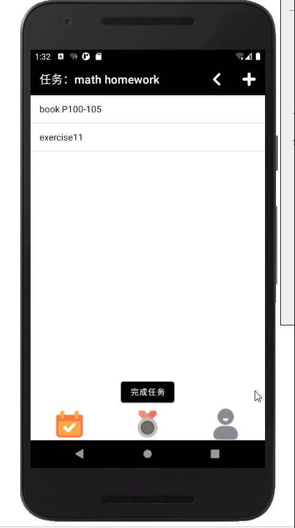

# bingo

儿童习惯养成app

+ 协助家长规划孩子的学习任务，培养孩子高效学习的习惯和管理时间的能力。

+ 包含：

  制定计划、执行计划、积分兑换、任务奖励、分析等。

## 展示

### 创建任务

+ 设置名称
+ 设置起止日期
+ 设置任务类型

### 设置任务

+ 长按修改或删除任务

### 创建子任务

+ 点击任务，进入子任务页面
+ 添加子任务

### 执行子任务

+ 点击子任务，进入执行界面

+ 点击开始，开始计时

  显示任务的：本次学习时间、累计学习时间

+ 点击完成，完成子任务

  注：完成任务需先完成所有子任务

### 奖励

+ 创建奖励

+ 点击兑换奖励，消耗点数

  

  

  

### 分析

+ 按照任务类型分类，显示完成数量所占比例

